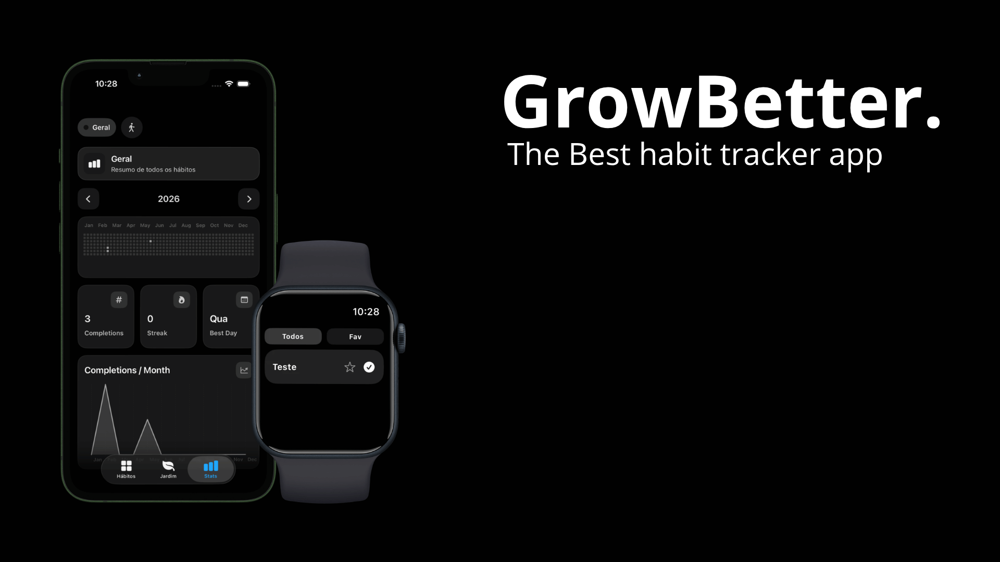

<p align="center">
  
</p>

# 🌱 GrowBetter

GrowBetter is a habit tracking app for iPhone and Apple Watch focused on visual progression, consistency and personal growth.  
*GrowBetter é um aplicativo de hábitos para iPhone e Apple Watch focado em progressão visual, consistência e crescimento pessoal.*

Instead of just checking tasks, the user evolves a living garden through daily habits, creating a more rewarding and immersive productivity experience.  
*Em vez de apenas marcar tarefas, o usuário evolui um jardim vivo através dos hábitos diários, criando uma experiência de produtividade mais imersiva e recompensadora.*

---

## ✨ Features  
*Funcionalidades*

- Habit tracking system  
  *Sistema de hábitos*

- Daily reminders and notifications  
  *Lembretes e notificações diárias*

- Visual garden progression  
  *Progressão visual de jardim*

- Apple Watch integration  
  *Integração com Apple Watch*

- SwiftData local persistence  
  *Persistência local com SwiftData*

- Modern SwiftUI interface  
  *Interface moderna em SwiftUI*

- Cross-device synchronization  
  *Sincronização entre dispositivos*

- Pixel-art inspired assets and visuals  
  *Assets e elementos visuais inspirados em pixel art*

---

## 🛠 Built With  
*Tecnologias utilizadas*

- Swift
- SwiftUI
- SwiftData
- WatchConnectivity
- Xcode

---

## 📱 Platforms  
*Plataformas*

- iPhone (iOS)
- Apple Watch (watchOS)

---

## 🚧 Project Status  
*Status do Projeto*

GrowBetter is currently in active development.  
*GrowBetter está atualmente em desenvolvimento ativo.*

Current version:  
*Versão atual:*

```txt
v0.1 Pre-release
```

More features, visual improvements and gameplay/progression systems are planned for future updates.  
*Novas funcionalidades, melhorias visuais e sistemas de progressão/gameplay estão planejados para futuras atualizações.*

---

## 📸 Preview  
*Prévia*

Coming soon.  
*Em breve.*

---

## 👨‍💻 Developer  
*Desenvolvedor*

J. Guilherme  
Lead Developer

Stay Tuned!  
*Continue acompanhando!*